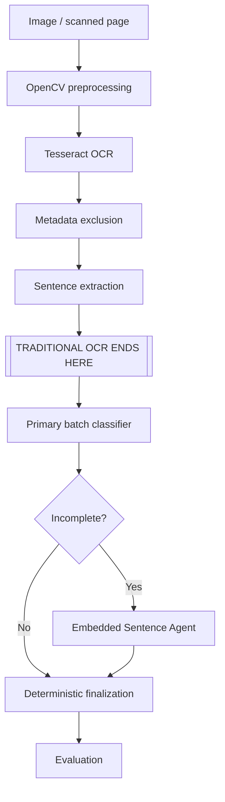

# Agentic Document Analysis

Traditional OCR, deterministic multi-agent sentence classification, evaluation,
and production system design.

## Overview

This repository implements a Generative AI Engineer technical assessment. Its
conceptual document flow is:

```text
Image or scanned page
  -> OpenCV preprocessing
  -> Tesseract OCR
  -> conservative metadata exclusion
  -> deterministic sentence segmentation
  -> batch classifier
  -> Embedded Sentence Agent only for Incomplete results
  -> deterministic final classification
  -> evaluation
```

OCR is traditional: preprocessing uses OpenCV and NumPy, and extraction uses
Tesseract through `pytesseract`. No LLM is used for image preprocessing, OCR,
metadata exclusion, or sentence segmentation.

The sentence-classification orchestrator is implemented and tested with injected
fake/mock clients. This repository does **not** contain a real LLM provider
adapter, a running web service, or an end-to-end PDF upload system.

## What is implemented

| Area | Status | What exists |
|---|---|---|
| Image preprocessing | Implemented | Validation, grayscale conversion, CLAHE, median denoising, adaptive thresholding, OpenCV deskew, light morphological closing, and binary output |
| OCR extraction | Implemented | Tesseract word text, confidence, bounding boxes, ordered lines, raw/body text, and low-confidence regions |
| Sentence segmentation | Implemented | Deterministic punctuation-based segmentation without spelling or grammar correction |
| OCR evaluation | Implemented | CER, WER, one-to-one Sentence F1, composite score, JSON validation, aggregation, and CLI reporting |
| Agent prompts | Implemented | Classifier and Embedded Sentence Agent prompts plus difficult examples and strict JSON contracts |
| Classification orchestration | Implemented | Immutable models, injected Protocol clients, batch handling, occurrence-based recovery, Python routing, embedded-span selection, and `agent_path` auditing |
| Retry/backoff | Implemented | Retry of explicit `RateLimitError` only, with immutable policy, capped exponential delay, and injected sleep |
| Source-Fidelity Score | Implemented | Heuristic SFS with occurrence-aware token alignment, tests, and worked examples |
| Real LLM provider adapter | **Not implemented** | No OpenAI, Anthropic, Claude, or other provider client is included |
| FastAPI/Celery/PostgreSQL runtime | **Architecture only** | Production components, persistence, migrations, and deployment are documented but not built |
| Hybrid Vision fallback | **Design only** | OCR-first, region-level Vision fallback is documented; no Vision integration exists |

## Architecture

The implemented OCR and classification logic has an explicit boundary:



Plain-text fallback:

```text
Image -> preprocessing -> Tesseract -> metadata exclusion -> sentences
=======================================================================
                      TRADITIONAL OCR ENDS HERE
=======================================================================
Primary classifier -> Incomplete?
                    -> no:  finalize directly
                    -> yes: Embedded Sentence Agent -> finalize
                    -> evaluation
```

The larger FastAPI, Celery, Redis, PostgreSQL, Alembic, Docker Compose, and image
storage design is documentation-only; see
[`section3/architecture.md`](section3/architecture.md).

## Repository structure

```text
app/ocr/
  preprocessing.py              OpenCV image preprocessing
  ocr_pipeline.py               Tesseract extraction and sentence segmentation
assessment/
  task1_1.md                    Preprocessing write-up
  task1_2.md                    OCR pipeline write-up
  task1_3.md                    Evaluation write-up
section1/
  eval.py                       CER, WER, Sentence F1, composite score, and CLI
section2/
  classifier.py                 Models, batching, routing, and retry behavior
  prompts/                      Classifier and embedded-agent prompts
  examples/                     Difficult prompt examples with expected JSON
  error_analysis.md             Classification confusion-matrix analysis
section3/
  architecture.md               Production system design
  model_migration.md            90-day model migration plan
  fidelity_tradeoff.md          Fidelity-versus-correction analysis
section4/
  sfs.py                        Source-Fidelity Score implementation
  task4_1.md                    SFS definition, examples, and limitations
  hybrid_fallback.md            Traditional OCR + Vision fallback design
tests/                          OCR, evaluation, orchestration, retry, and SFS tests
```

Every path above exists in the repository. Section 3 and the hybrid fallback are
design documents, not deployed infrastructure.

## Core technical decisions

- **Tesseract rather than Torch-based OCR:** it provides local, deterministic,
  inspectable OCR data with confidence and geometry while avoiding a large
  deep-learning runtime for this assessment environment.
- **No LLM in OCR:** OCR text remains attributable to Tesseract and deterministic
  rules; classification begins only after sentence extraction.
- **Hand-written orchestration rather than LangGraph:** the routing graph is
  small, fixed, and clearer as ordinary Python with explicit invariants.
- **Code-enforced routing:** only `SentenceCategory.INCOMPLETE` invokes the
  Embedded Sentence Agent; agent prose cannot choose the next component.
- **Immutable dataclasses:** request/result models and retry policy are frozen,
  supporting predictable, thread-safe orchestration.
- **Protocol-based dependency injection:** provider-specific clients can be
  supplied without coupling domain code to an SDK. Current tests use fake/mock
  clients only.
- **Occurrence/index-based mapping:** duplicate sentences remain distinct, and
  missing batch occurrences are recovered individually without silent loss.
- **Narrow retry behavior:** only explicit `RateLimitError` failures retry;
  validation, contract, and arbitrary failures propagate immediately.
- **Exact source preservation:** agent responses and embedded spans are validated
  against original text; spelling, punctuation, and capitalization are not
  silently corrected.
- **SFS complements CER/WER:** Source-Fidelity Score targets sensitive surface
  forms but remains heuristic and is not a replacement for edit-distance metrics.

## Installation

Requirements:

- Python 3.12
- [`uv`](https://docs.astral.sh/uv/)
- Tesseract installed as a system dependency

On macOS, install Tesseract with:

```bash
brew install tesseract
```

Install the Python project and development dependencies:

```bash
uv sync
```

## Running tests

Run the full test suite, lint checks, and compilation checks:

```bash
uv run pytest -v
uv run ruff check .
uv run python -m compileall app section1 section2 section4 tests
```

Section 2 tests use deterministic fake/mock clients. They verify orchestration,
validation, batching, routing, and retry behavior, but they do not measure a real
LLM. The OCR suite includes an integration-style smoke test that runs real
Tesseract when the executable is installed; otherwise that test is skipped.

## Running OCR manually

The implemented OCR pipeline can process a real image using local Tesseract:

```python
from app.ocr.ocr_pipeline import extract_text_and_sentences

result = extract_text_and_sentences("path/to/document.png")

print(result.raw_text)
print(result.body_text)
print(result.sentences)
for region in result.low_confidence_regions:
    print(region.text, region.confidence, region.left, region.top)
```

`raw_text` retains all extracted lines. `body_text` and `sentences` exclude only
lines matched by the conservative metadata heuristic.

## Running the evaluation CLI

Create a JSON file containing transcription pairs:

```json
[
  {
    "sample_id": "sample-1",
    "ground_truth": "...",
    "predicted": "..."
  }
]
```

Run the evaluator:

```bash
uv run python section1/eval.py path/to/evaluation.json
```

The report contains per-sample and macro CER, WER, sentence precision/recall/F1,
and the composite score.

## Running the Source-Fidelity Score

```python
from section4.sfs import sfs

score = sfs("Please wait!!!", "Please wait!")
print(score)
```

The score is below 1.0 because the punctuation-sensitive `wait!!!` occurrence
was normalized. The current heuristic also treats sentence-initial `Please` as
sensitive and preserved, so this example receives partial rather than zero
credit. SFS is intentionally interpreted alongside CER and WER.

## Testing philosophy

- Unit tests verify deterministic contracts: validation, ordering, duplicate
  handling, routing, retries, metric calculations, and source preservation.
- Smoke tests verify that the local Tesseract integration can execute on a real
  generated image when Tesseract is available.
- Labelled golden datasets are required to measure OCR quality and the quality of
  any future real LLM adapter.
- Passing tests demonstrates implemented behavior; it does not prove perfect
  handwriting recognition, classification accuracy, or production readiness.

Actual LLM quality evaluation requires both a concrete provider adapter and a
representative labelled golden dataset. Neither is included here.

## Current limitations

- Tesseract handwriting accuracy varies with writer, scan quality, ink, layout,
  and language.
- Metadata exclusion uses conservative heuristics and can miss metadata or remove
  a title-like first line.
- Sentence segmentation is rule-based and can split abbreviations or miss
  punctuation-free boundaries.
- Source-Fidelity Score is heuristic; ordinary-looking misspellings such as
  `chlid` may not be detected as sensitive.
- No real LLM provider adapter or real agent inference is included.
- There is no running FastAPI/Celery/Redis/PostgreSQL stack, database schema,
  Alembic migration, Docker Compose deployment, or object-storage integration.
- Hybrid Vision fallback is a design only and is not implemented.
- There is no frontend or real end-to-end PDF upload API.
- No benchmark accuracy, throughput, latency, or cost claims are established by
  this repository.

## Future production version

The production design proposes—but does not currently implement:

- a FastAPI image/PDF upload, status, and results API;
- independent Celery OCR and classification workers with Redis queues;
- PostgreSQL persistence and Alembic-only schema migrations;
- Docker Compose for reproducible service startup;
- durable object storage for source images and page renders;
- concrete, versioned LLM provider adapters behind the existing Protocols;
- a labelled golden-set evaluation and model-migration harness; and
- optional region-level Vision fallback for evidence-based low-confidence areas.

See the documents in [`section3/`](section3/) and
[`section4/hybrid_fallback.md`](section4/hybrid_fallback.md) for these designs.

## Assessment coverage

- [x] Section 1 — Traditional OCR and evaluation
- [x] Section 2 — Agent prompts, deterministic orchestration, reliability, and
  error analysis
- [x] Section 3 — Production architecture, model migration, and fidelity analysis
- [x] Bonus Section 4 — Source-Fidelity Score and hybrid fallback design

“Complete” here means the requested assessment code or documentation artifact is
present. It does not mean that documentation-only production components have
been deployed.

## Security and configuration

No real provider API keys are required by the implemented code, and credentials
must never be committed to source control. Future provider or service
configuration should be supplied through environment variables or a deployment
secret mechanism. Logs and evaluation artifacts should avoid exposing document
content, and any future Vision provider must satisfy applicable privacy,
retention, residency, and access-control requirements.
