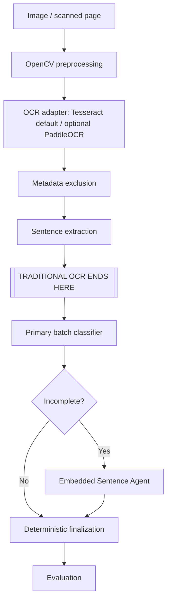

# Agentic Document Analysis

Traditional OCR, deterministic multi-agent sentence classification, evaluation,
and production system design.

## Overview

This repository implements a Generative AI Engineer technical assessment. Its
conceptual document flow is:

```text
Image or scanned page
  -> OpenCV preprocessing
  -> selectable OCR adapter (Tesseract by default; optional PaddleOCR)
  -> conservative metadata exclusion
  -> deterministic sentence segmentation
  -> batch classifier
  -> Embedded Sentence Agent only for Incomplete results
  -> deterministic final classification
  -> evaluation
```

OCR is local and non-LLM-based: preprocessing uses OpenCV and NumPy, while a
shared adapter contract supports Tesseract through `pytesseract` and optional
PaddleOCR PP-OCRv5 inference. Tesseract remains the default. No LLM is used for
image preprocessing, OCR, metadata exclusion, or sentence segmentation.

The sentence-classification orchestrator is implemented and tested with injected
fake/mock clients. This repository does **not** contain a real LLM provider
adapter, a running web service, or an end-to-end PDF upload system.

## What is implemented

| Area | Status | What exists |
|---|---|---|
| Image preprocessing | Implemented | Validation, grayscale conversion, CLAHE, median denoising, adaptive thresholding, OpenCV deskew, light morphological closing, and binary output |
| OCR extraction | Implemented | Selectable Tesseract and optional PaddleOCR adapters, normalized confidence, bounding boxes, ordered lines, raw/body text, and low-confidence regions |
| Sentence segmentation | Implemented | Deterministic punctuation-based segmentation without spelling or grammar correction |
| OCR evaluation | Implemented | CER, WER, one-to-one Sentence F1, composite score, JSON validation, aggregation, and CLI reporting |
| Agent prompts | Implemented | Classifier and Embedded Sentence Agent prompts plus difficult examples and strict JSON contracts |
| Classification orchestration | Implemented | Immutable models, injected Protocol clients, batch handling, occurrence-based recovery, Python routing, embedded-span selection, and `agent_path` auditing |
| Retry/backoff | Implemented | Retry of explicit `RateLimitError` only, with immutable policy, capped exponential delay, and injected sleep |
| Source-Fidelity Score | Implemented | Heuristic SFS with occurrence-aware token alignment, tests, and worked examples |
| Real LLM provider adapter | **Not implemented** | No OpenAI, Anthropic, Claude, or other provider client is included |
| FastAPI/Celery/PostgreSQL runtime | **Architecture only** | Production components, persistence, migrations, and deployment are documented but not built |
| Hybrid Vision fallback | **Design only** | OCR-first, region-level Vision fallback is documented; no Vision integration exists |

## Architecture

The implemented OCR and classification logic has an explicit boundary:



Plain-text fallback:

```text
Image -> preprocessing -> selected OCR adapter -> metadata exclusion -> sentences
=======================================================================
                      TRADITIONAL OCR ENDS HERE
=======================================================================
Primary classifier -> Incomplete?
                    -> no:  finalize directly
                    -> yes: Embedded Sentence Agent -> finalize
                    -> evaluation
```

The larger FastAPI, Celery, Redis, PostgreSQL, Alembic, Docker Compose, and image
storage design is documentation-only; see
[`section3/architecture.md`](section3/architecture.md).

## Repository structure

```text
app/ocr/
  config.py                     Centralized environment configuration
  engine.py                     Shared OCR adapter protocol and immutable models
  factory.py                    Explicit Tesseract/PaddleOCR engine selection
  preprocessing.py              OpenCV image preprocessing
  tesseract_engine.py           Default Tesseract adapter
  paddle_engine.py              Optional lazy PaddleOCR PP-OCRv5 adapter
  ocr_pipeline.py               Common OCR result and sentence segmentation
  cli.py                        Selectable-engine JSON command-line runner
assessment/
  task1_1.md                    Preprocessing write-up
  task1_2.md                    OCR pipeline write-up
  task1_3.md                    Evaluation write-up
section1/
  eval.py                       CER, WER, Sentence F1, composite score, and CLI
section2/
  classifier.py                 Models, batching, routing, and retry behavior
  prompts/                      Classifier and embedded-agent prompts
  examples/                     Difficult prompt examples with expected JSON
  error_analysis.md             Classification confusion-matrix analysis
section3/
  architecture.md               Production system design
  model_migration.md            90-day model migration plan
  fidelity_tradeoff.md          Fidelity-versus-correction analysis
section4/
  sfs.py                        Source-Fidelity Score implementation
  task4_1.md                    SFS definition, examples, and limitations
  hybrid_fallback.md            Traditional OCR + Vision fallback design
tests/                          OCR, evaluation, orchestration, retry, and SFS tests
tools/
  compare_ocr_profiles.py       Deterministic OCR-profile comparison utility
```

Every path above exists in the repository. Section 3 and the hybrid fallback are
design documents, not deployed infrastructure.

## Core technical decisions

- **Tesseract remains the default:** it provides local, deterministic,
  inspectable OCR data with confidence and geometry while keeping the normal
  assessment environment lightweight. PaddleOCR is an explicit optional choice.
- **No LLM in OCR:** OCR text remains attributable to the selected local engine
  and deterministic rules; classification begins only after sentence extraction.
- **Hand-written orchestration rather than LangGraph:** the routing graph is
  small, fixed, and clearer as ordinary Python with explicit invariants.
- **Code-enforced routing:** only `SentenceCategory.INCOMPLETE` invokes the
  Embedded Sentence Agent; agent prose cannot choose the next component.
- **Immutable dataclasses:** request/result models and retry policy are frozen,
  supporting predictable, thread-safe orchestration.
- **Protocol-based dependency injection:** provider-specific clients can be
  supplied without coupling domain code to an SDK. Current tests use fake/mock
  clients only.
- **Occurrence/index-based mapping:** duplicate sentences remain distinct, and
  missing batch occurrences are recovered individually without silent loss.
- **Narrow retry behavior:** only explicit `RateLimitError` failures retry;
  validation, contract, and arbitrary failures propagate immediately.
- **Exact source preservation:** agent responses and embedded spans are validated
  against original text; spelling, punctuation, and capitalization are not
  silently corrected.
- **SFS complements CER/WER:** Source-Fidelity Score targets sensitive surface
  forms but remains heuristic and is not a replacement for edit-distance metrics.

## Installation

Requirements:

- Python 3.12
- [`uv`](https://docs.astral.sh/uv/)
- Tesseract installed as a system dependency

On macOS, install Tesseract with:

```bash
brew install tesseract
```

Install the Python project and development dependencies:

```bash
uv sync
```

PaddleOCR is optional. Install its dependency extra only when needed:

```bash
uv sync --extra paddle
```

The locked, proven optional versions are PaddlePaddle 3.0.0 and PaddleOCR
3.7.0. This configuration was verified on macOS x86_64 (Intel), Python 3.12,
with CPU inference. Other platforms may have different wheel availability or
native-runtime behavior.

Paddle model files download on first use and are not stored in this repository.
CPU inference is slower and heavier than Tesseract, native compatibility varies
by platform, and large images are downscaled to a maximum 2000-pixel side before
inference by default.

## Running tests

Run the full test suite, lint checks, and compilation checks:

```bash
uv run pytest -q
uv run ruff check .
uv run python -m compileall app tests
```

The final lightweight validation result was `244 passed, 1 skipped`. The skip is
the explicitly gated real PaddleOCR smoke test. Normal tests and CI do not need
the Paddle extra, initialize PaddleOCR, download models, or require network
access.

Section 2 tests use deterministic fake/mock clients. They verify orchestration,
validation, batching, routing, and retry behavior, but they do not measure a real
LLM. The OCR suite includes an integration-style smoke test that runs real
Tesseract when the executable is installed. Mocked Paddle adapter tests do not
import PaddleOCR or download models. Real Paddle inference is separately gated.

## Running OCR manually

The implemented OCR pipeline can process a real image using local Tesseract:

```python
from app.ocr.ocr_pipeline import extract_text_and_sentences

result = extract_text_and_sentences("path/to/document.png")

print(result.raw_text)
print(result.body_text)
print(result.sentences)
for region in result.low_confidence_regions:
    print(region.text, region.confidence, region.left, region.top)
```

`raw_text` retains all extracted lines. `body_text` and `sentences` exclude only
lines matched by the conservative metadata heuristic.

To select PaddleOCR explicitly in Python:

```python
from app.ocr.factory import create_ocr_engine
from app.ocr.ocr_pipeline import extract_text_and_sentences

engine = create_ocr_engine("paddle")
result = extract_text_and_sentences("path/to/document.png", engine=engine)
```

The low-level pipeline does not read environment variables. Configuration is
resolved once at the CLI boundary with this precedence:

1. explicit CLI `--engine`;
2. `OCR_ENGINE`; and
3. the default, `tesseract`.

The repository provides `.env.example` with `OCR_ENGINE=tesseract`. A real
`.env` is ignored and is not automatically loaded; export the variable or
prefix the command. Valid end-to-end commands are:

```bash
# Tesseract (also the default when OCR_ENGINE is absent)
OCR_ENGINE=tesseract \
uv run python -m app.ocr.cli \
  samples/testing_pages/page-1.png \
  --output artifacts/ocr/tesseract-result.json

# Optional PaddleOCR
OMP_NUM_THREADS=1 \
OPENBLAS_NUM_THREADS=1 \
VECLIB_MAXIMUM_THREADS=1 \
OCR_ENGINE=paddle \
uv run --extra paddle python -m app.ocr.cli \
  samples/testing_pages/page-1-small.png \
  --output artifacts/ocr/paddle-result.json
```

An explicit Paddle request raises actionable errors when its optional runtime is
missing; it never silently falls back to Tesseract.

The JSON output contains `source_image`, `configured_engine`, `engine_name`,
`engine_version`, `raw_text`, `body_text`, `sentences`,
`excluded_metadata_lines`, and `low_confidence_regions`. Each low-confidence
region includes confidence, source-image geometry, and page/line identifiers.

## Handwritten OCR Engine Evaluation

Tesseract was initially used as the OCR baseline for handwritten document
images. On the supplied handwritten test document, its transcription was
largely unusable, so PaddleOCR PP-OCRv5 was evaluated as an alternative
handwriting OCR engine.

### PaddleOCR environment

PaddlePaddle 3.0.0 and PaddleOCR 3.7.0 were installed and verified natively on
macOS x86_64 (Intel), using Python 3.12 and CPU inference. The PaddlePaddle CPU
verification check completed successfully. Paddle remains an optional dependency
extra so the default project environment stays lightweight.

### Models and inference configuration

The initial attempt used `PP-OCRv5_server_det` and `PP-OCRv5_server_rec`. The
original image was 4959x7017 pixels, and native server-model inference
encountered a segmentation fault after PaddleOCR attempted to resize this
oversized input.

For a stable experiment, the image was downscaled to 1413x2000 pixels and
processed with:

- `PP-OCRv5_mobile_det`
- `PP-OCRv5_mobile_rec`
- CPU inference with MKL-DNN disabled and CPU threads limited
- `text_det_limit_side_len=1600`
- `text_det_limit_type="max"`

This configuration successfully processed the handwritten page. Downscaling
improved inference stability, although it may have removed fine handwriting
detail.

The implemented adapter safely downsizes oversized inputs without cropping,
maps detected coordinates back to the original preprocessed-image space, and
normalizes confidence from Paddle's `[0, 1]` range to the shared `[0, 100]`
range. It reconstructs reading order geometrically rather than trusting
detection order. Model construction is lazy and protected by an initialization
lock; prediction calls use a separate serialization lock because native-runtime
thread safety is not assumed. No silent Tesseract fallback occurs. The first
Paddle run may download model files into Paddle's external cache.

### Result and interpretation

PaddleOCR recovered substantially more recognizable handwritten content than
the Tesseract baseline, including names, headings, and meaningful sentence
fragments. Against a manually prepared, best-effort ground-truth transcription
for the one supplied handwritten `page-1`, the PaddleOCR result was:

| Metric | Score |
|---|---:|
| CER | 0.3966 |
| WER | 0.7704 |
| Sentence Precision | 0.0000 |
| Sentence Recall | 0.0000 |
| Sentence F1 | 0.0000 |
| Composite Score | 0.2916 |

An earlier Tesseract CER of approximately 0.98 is **not** a directly comparable
final benchmark because that evaluation used incomplete or placeholder ground
truth. A fair numerical comparison between Tesseract and PaddleOCR requires
rerunning both engines against the exact same finalized ground-truth set. CER
and WER must always be calculated against human ground truth, not text generated
by another OCR engine.

OCR confidence is diagnostic engine output, not a measure of transcription
correctness. PaddleOCR's bounding boxes should be used to reconstruct reading
order because detection order can split or reorder fragments from the same
handwritten line. CER and WER measure transcription error, while the
Source-Fidelity Score complements them for fidelity-sensitive text and should
remain part of evaluation.

The experiment supports the following current decision:

- **Tesseract:** implemented baseline OCR engine.
- **PaddleOCR PP-OCRv5:** experimentally validated and currently stronger
  candidate for the supplied handwriting, now available through an optional
  adapter but not the default or a production deployment.

The experiment does not establish production-quality handwriting recognition.
Further benchmarking should test multiple image resolutions and model
configurations against the same golden human-transcribed ground-truth set.

A common selectable engine interface is now implemented:

```text
OCR Engine Interface
├── TesseractOCR      # implemented baseline
└── PaddleOCR         # optional handwriting candidate
```

Experiment evidence is preserved at:

- `samples/testing_pages/page-1.png`
- `samples/testing_pages/page-1-small.png`
- `samples/results/paddle_evaluation.json`
- `artifacts/paddleocr/page-1.json`
- `artifacts/ocr_profiles/`

## Running the evaluation CLI

Create a JSON file containing transcription pairs:

```json
[
  {
    "sample_id": "sample-1",
    "ground_truth": "...",
    "predicted": "..."
  }
]
```

Run the evaluator:

```bash
uv run python section1/eval.py path/to/evaluation.json
```

Here `ground_truth` must be a manually prepared human reference and `predicted`
must be machine-generated OCR output. Machine output must never be reused as its
own ground truth. CER and WER compare the prediction against that reference. The
report contains per-sample and macro CER, WER, sentence precision/recall/F1, and
the composite score.

## Running the Source-Fidelity Score

```python
from section4.sfs import sfs

score = sfs("Please wait!!!", "Please wait!")
print(score)
```

The score is below 1.0 because the punctuation-sensitive `wait!!!` occurrence
was normalized. The current heuristic also treats sentence-initial `Please` as
sensitive and preserved, so this example receives partial rather than zero
credit. SFS is intentionally interpreted alongside CER and WER.

## Testing philosophy

- Unit tests verify deterministic contracts: validation, ordering, duplicate
  handling, routing, retries, metric calculations, and source preservation.
- Smoke tests verify that the local Tesseract integration can execute on a real
  generated image when Tesseract is available.
- Mocked Paddle tests cover lazy initialization, optional-dependency failures,
  confidence/box conversion, bounded image resizing, coordinate restoration,
  deterministic reading order, malformed/empty output, and engine selection.
- Real Paddle inference is skipped during normal testing. Run it explicitly in
  the optional Paddle environment with the actual gated test path:

  ```bash
  OMP_NUM_THREADS=1 \
  OPENBLAS_NUM_THREADS=1 \
  VECLIB_MAXIMUM_THREADS=1 \
  RUN_PADDLE_OCR_SMOKE=1 \
  uv run --extra paddle pytest \
    tests/test_paddle_engine.py::test_real_paddle_smoke -v
  ```

- Labelled golden datasets are required to measure OCR quality and the quality of
  any future real LLM adapter.
- Passing tests demonstrates implemented behavior; it does not prove perfect
  handwriting recognition, classification accuracy, or production readiness.

Actual LLM quality evaluation requires both a concrete provider adapter and a
representative labelled golden dataset. Neither is included here.

## Reviewer submission checklist

1. Install Python 3.12 and `uv`.
2. Install system Tesseract (`brew install tesseract` on macOS).
3. Run `uv sync` for the lightweight default installation.
4. Run `uv run pytest -q`, `uv run ruff check .`, and
   `uv run python -m compileall app tests`.
5. Run the Tesseract CLI command in “Running OCR manually”.
6. Optional: run `uv sync --extra paddle`.
7. Optional: run the gated Paddle test and Paddle CLI command above. The first
   real Paddle invocation may download external model files.

## Current limitations

- Tesseract handwriting accuracy varies with writer, scan quality, ink, layout,
  and language.
- PaddleOCR is an optional, heavier runtime; first use downloads models, CPU
  inference is slower, and native behavior can vary across platforms.
- Metadata exclusion uses conservative heuristics and can miss metadata or remove
  a title-like first line.
- Sentence segmentation is rule-based and can split abbreviations or miss
  punctuation-free boundaries.
- Source-Fidelity Score is heuristic; ordinary-looking misspellings such as
  `chlid` may not be detected as sensitive.
- No real LLM provider adapter or real agent inference is included.
- There is no running FastAPI/Celery/Redis/PostgreSQL stack, database schema,
  Alembic migration, Docker Compose deployment, or object-storage integration.
- Hybrid Vision fallback is a design only and is not implemented.
- There is no frontend or real end-to-end PDF upload API.
- No benchmark accuracy, throughput, latency, or cost claims are established by
  this repository.

## Future production version

The production design proposes—but does not currently implement:

- a FastAPI image/PDF upload, status, and results API;
- independent Celery OCR and classification workers with Redis queues;
- PostgreSQL persistence and Alembic-only schema migrations;
- Docker Compose for reproducible service startup;
- durable object storage for source images and page renders;
- concrete, versioned LLM provider adapters behind the existing Protocols;
- a labelled golden-set evaluation and model-migration harness; and
- optional region-level Vision fallback for evidence-based low-confidence areas.

See the documents in [`section3/`](section3/) and
[`section4/hybrid_fallback.md`](section4/hybrid_fallback.md) for these designs.

## Assessment coverage

- [x] Section 1 — Traditional OCR and evaluation
- [x] Section 2 — Agent prompts, deterministic orchestration, reliability, and
  error analysis
- [x] Section 3 — Production architecture, model migration, and fidelity analysis
- [x] Bonus Section 4 — Source-Fidelity Score and hybrid fallback design

“Complete” here means the requested assessment code or documentation artifact is
present. It does not mean that documentation-only production components have
been deployed.

## Security and configuration

No real provider API keys are required by the implemented code, and credentials
must never be committed to source control. Future provider or service
configuration should be supplied through environment variables or a deployment
secret mechanism. Logs and evaluation artifacts should avoid exposing document
content, and any future Vision provider must satisfy applicable privacy,
retention, residency, and access-control requirements.
