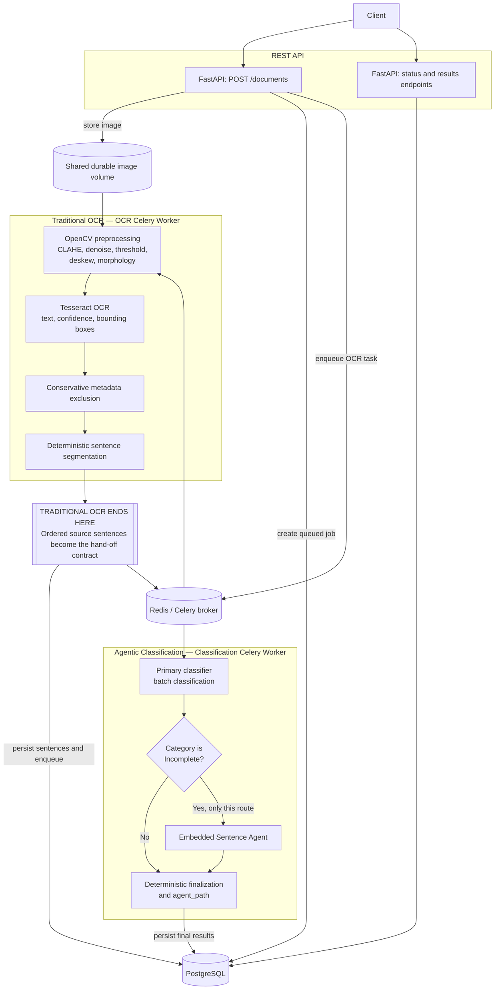

# Section 3.1 — End-to-End System Architecture

## 1. High-level architecture

The system uses two asynchronous stages. Traditional OCR owns image preparation,
text extraction, metadata exclusion, and deterministic sentence segmentation.
Agentic classification begins only after an ordered sentence list has been
persisted. This boundary keeps OCR independently testable and prevents
classification failures from requiring the image to be processed again.



Plain-text view of the same boundary and flow:

```text
+--------+     +----------------------------+
| Client | --> | FastAPI: upload/status/get |
+--------+     +-------------+--------------+
                            | store image + create job
                            v
                 +----------+----------+       +------------+
                 | PostgreSQL metadata |       | Image volume|
                 +----------+----------+       +------------+
                            |
                            | enqueue
                            v
                     +------+------+
                     | Redis broker |
                     +------+------+
                            |
        +-------------------v----------------------------------+
        | TRADITIONAL OCR — OCR CELERY WORKER                  |
        | OpenCV preprocessing (CLAHE / threshold / deskew /   |
        | morphology) -> Tesseract -> metadata exclusion ->    |
        | deterministic sentence segmentation                 |
        +-------------------+----------------------------------+
                            |
        ========================================================
                    TRADITIONAL OCR ENDS HERE
             Hand-off: ordered, verbatim source sentences
        ========================================================
                            |
                  enqueue classification
                            v
        +-------------------+----------------------------------+
        | AGENTIC CLASSIFICATION — CLASSIFICATION CELERY WORKER|
        | Primary batch classifier -> category Incomplete?     |
        |       no  -> deterministic finalization              |
        |       yes -> Embedded Sentence Agent -> finalization |
        +-------------------+----------------------------------+
                            |
                            v
                     +------+------+
                     | PostgreSQL  |
                     +------+------+
                            |
                            v
                 GET status/results through FastAPI
```

## 2. Docker architecture

Docker Compose defines a small set of independently runnable services:

| Container or job | Responsibility |
|---|---|
| `api` | Stateless FastAPI upload, status, and result service |
| `redis` | Celery broker and temporary queue buffer |
| `postgres` | Durable relational state and results |
| `ocr-worker` | Celery worker consuming only the OCR queue |
| `classification-worker` | Celery worker consuming only the classification queue |
| `migrate` | One-shot Alembic migration job |
| `flower` (optional) | Development/operations view of Celery tasks and queues |

The API and both worker images can share the same application build while using
different startup commands. A named, durable volume holds PostgreSQL data; a
separate shared upload volume makes source images available to OCR workers. The
database stores each image's path, checksum, media type, and ownership metadata
rather than embedding large binaries in ordinary result rows.

Docker Compose provides reproducible development, one-command startup, isolated
service dependencies, and a consistent local environment. After configuration,
the stack starts with:

```text
docker compose up
```

Health checks and dependency conditions should prevent the migration job from
running before PostgreSQL is ready and prevent API/worker startup before a
successful migration.

## 3. Component descriptions

### FastAPI

FastAPI validates file type, configured size limits, and required request
metadata; writes the source image to durable shared storage; creates the job and
document records transactionally; and enqueues an OCR task. It exposes upload,
status, and result endpoints. The API is stateless, does not perform OCR in the
request process, and never runs database migrations.

### Redis

Redis is the Celery broker for separate OCR and classification queues. It buffers
short traffic bursts and allows API requests to finish without waiting for OCR
or classification. Redis is not the system of record: acknowledged task results
and processing state are stored in PostgreSQL.

### OCR Celery Worker

The OCR worker loads the stored image and runs the Section 1 pipeline: validation,
grayscale conversion, CLAHE, median denoising, adaptive thresholding, deskew,
light morphological closing, and binary normalization. Tesseract then returns
verbatim text, confidence values, and bounding boxes. The worker conservatively
excludes likely page metadata from body text, segments sentences with the same
deterministic rule, persists OCR artifacts and low-confidence regions, advances
the status, and enqueues classification. This is the end of traditional OCR.

### Classification Celery Worker

The classification worker reads persisted sentences in document order. It sends
the primary classifier a batch, recovers missing response occurrences
individually, and validates exact source copying. Python code routes only
`Incomplete` sentences to the Embedded Sentence Agent. Final selection,
category precedence, and `agent_path` are deterministic. Explicit HTTP 429
responses use the bounded exponential retry and backoff policy from Section 2;
validation and contract failures are not retried.

### PostgreSQL

PostgreSQL is the durable source of truth. A practical normalized schema stores:

| Entity | Important data |
|---|---|
| `jobs` | `job_id`, processing status, error details, attempts, timestamps |
| `documents` | job relationship, image path, checksum, media type, size |
| `ocr_results` | raw OCR text, body text, engine name/version, timestamps |
| `sentences` | document relationship, stable ordinal, verbatim sentence text |
| `classifications` | original and final labels, reason, embedded sentence, immutable `agent_path` |
| `confidence_regions` | token text, confidence, bounding box, page/block/paragraph/line identifiers |

`processing_status` is represented by the job state (`queued`,
`processing_ocr`, `classifying`, `completed`, or `failed`). Foreign keys,
uniqueness constraints such as `(document_id, ordinal)`, and transactions protect
ordering and prevent duplicate final rows. Errors and timestamps support audit,
diagnosis, and latency measurement.

## 4. Alembic migrations

Alembic is the only supported schema migration mechanism. Each revision is
version-controlled, ordered, reviewable, and recorded in PostgreSQL's migration
history. Deployments apply the intended schema with:

```text
alembic upgrade head
```

The deployment order is:

```text
PostgreSQL becomes healthy
          |
          v
Run the one-shot Alembic migration exactly once
          |
          v
Start FastAPI
          |
          v
Start OCR and classification workers
```

Neither API nor worker startup may call Alembic automatically; concurrent
application instances must not race to alter the schema. Migration rollback is
not assumed to be lossless: a downgrade cannot restore discarded or transformed
data, and long-running destructive changes may be unsafe. Revisions must test
both the supported downgrade, where practical, and a forward-fix recovery path.

Zero-downtime changes follow **Expand → Migrate → Contract**:

1. **Expand:** add backward-compatible tables, columns, or indexes while old and
   new application versions can both run.
2. **Migrate:** backfill or transform data in bounded, observable batches and
   switch reads/writes only after verification.
3. **Contract:** remove obsolete schema only after every running application
   version has stopped depending on it.

## 5. API design

### `POST /documents`

Accepts a supported image as multipart form data. After validation, durable image
storage, job creation, and successful queue submission, it returns **HTTP 202
Accepted**:

```json
{
  "job_id": "4fa294c1-94bb-45a6-9a76-9862c0ad93cb",
  "status": "queued"
}
```

Malformed files receive a 4xx response and are not queued. An idempotency key is
recommended so a repeated client request does not unintentionally create two
jobs for the same upload.

### `GET /documents/{job_id}/status`

Returns the current state and timestamps. The status is exactly one of:

- `queued`
- `processing_ocr`
- `classifying`
- `completed`
- `failed`

A failed response includes a safe error code and summary, while detailed
internal diagnostics remain in restricted logs/database fields.

### `GET /documents/{job_id}/results`

For a completed job, returns raw OCR text, body text, the ordered sentence list,
classification results, selected embedded sentences, confidence regions, OCR
engine metadata, processing timestamps, and per-stage durations. Classification
items include original/final categories, reason, and `agent_path`. Before
completion the endpoint returns a clear conflict or not-ready response with the
current status; an unknown job returns HTTP 404.

## 6. Complete data flow

1. The client uploads an image with `POST /documents`.
2. FastAPI validates the request and stores the unmodified image durably.
3. In one database transaction, FastAPI creates document and `queued` job rows.
4. FastAPI enqueues the job identifier on the OCR queue and returns HTTP 202.
5. An OCR worker claims the job, atomically changes status to `processing_ocr`,
   and loads the image.
6. Preprocessing and Tesseract produce binary image output, verbatim OCR text,
   bounding boxes, and confidence regions.
7. Metadata exclusion produces body text, and deterministic segmentation creates
   ordered sentences. OCR results are persisted once.
8. The OCR worker changes status to `classifying` and enqueues the job identifier
   on the classification queue.
9. A classification worker batch-classifies the ordered sentences and recovers
   any missing batch occurrences individually.
10. Python routing invokes the Embedded Sentence Agent only for `Incomplete`
    primary results and deterministically constructs final classifications.
11. Results, embedded sentences, categories, reasons, and agent paths are saved
    transactionally; the job becomes `completed`. An unrecoverable stage error
    records a safe error and marks the job `failed`.
12. The client polls status and retrieves completed results through FastAPI.

Tasks should use the job identifier as their stable key and make persistence
idempotent. A redelivered Celery message can then observe a completed stage
instead of creating duplicate sentences or classifications.

## 7. Capacity planning for 500 images/hour

The target is approximately **500 images/hour**, or **8.3 images/minute**. The
API remains stateless so replicas can accept uploads independently. OCR and
classification have separate queues and worker pools because their bottlenecks
differ: OCR is CPU-intensive, while classification is commonly constrained by
external request latency and rate limits. Queue buffering absorbs bursts without
holding HTTP connections open.

Capacity should be proven with representative page sizes and handwriting rather
than assumed from request counts. If average service time for a stage is `S`
minutes per image, its theoretical minimum active concurrency is approximately
`8.3 × S`; production allocation should add measured headroom for tail latency,
retries, and worker restarts. Horizontal scaling can then add OCR worker
processes/containers independently from classification workers.

Autoscaling signals should include:

- queue depth and oldest-message age for each queue;
- OCR and classification processing latency, including p95/p99;
- arrival rate, completion throughput, and failure/retry rate;
- CPU and memory saturation for OCR workers;
- classification rate-limit frequency and external latency.

Batch classification reduces LLM API requests and request overhead while the
existing missing-response recovery ensures no sentence is silently lost. Scale
testing should confirm sustained throughput above 500 images/hour, bounded queue
age during bursts, and acceptable end-to-end completion latency before release.
